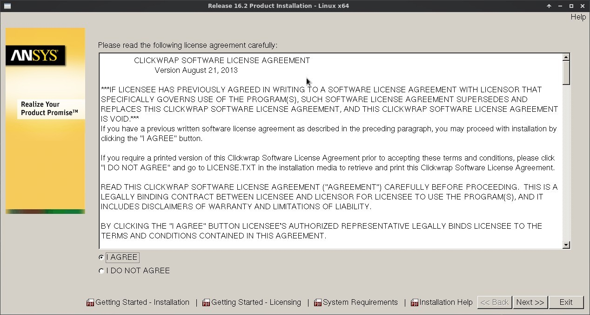
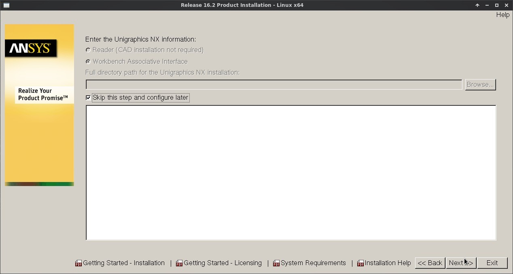
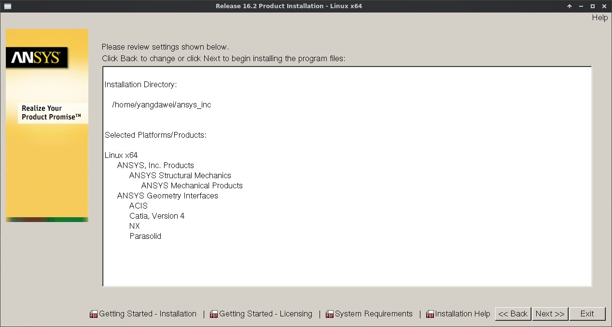
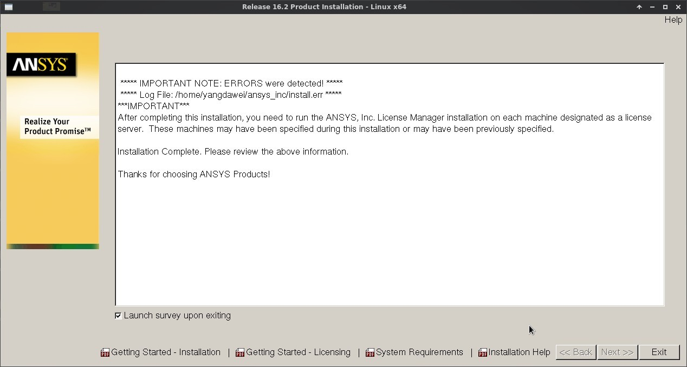
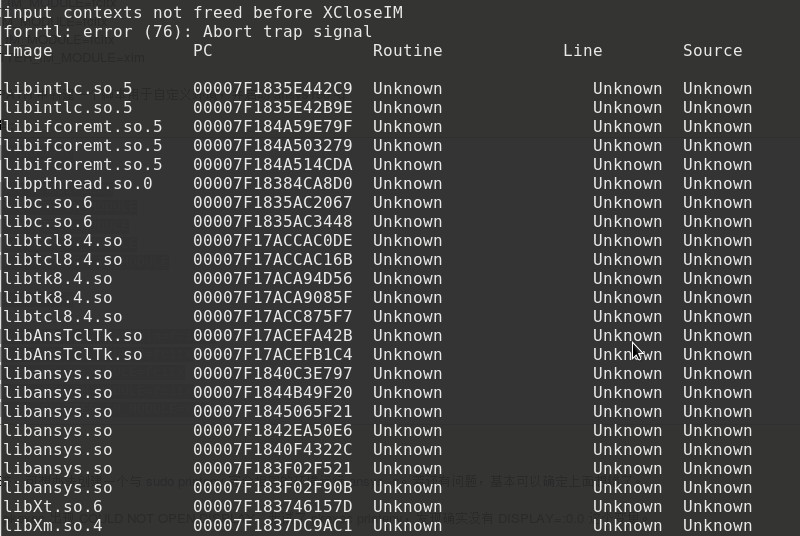

# 安装

系统：Debian jessie x64

版本：ANSYS 16.2

## 环境准备

```
sudo apt-get install build-essential
sudo apt-get install xterm libstdc++-4.8-dev libmotif-dev libxtst-dev  libxt-dev libzip-dev  libxmu-dev libxp6
sudo apt-get install tcl8.5-dev tk8.5-dev
sudo apt-get install lsb csh xfonts-75dpi xfonts-100dpi wine
```
## 镜像加载
```
sudo mkdir /mnt/ansys1 /mnt/ansys2
sudo mount ANSYS162_LINX64_Disk1.iso /mnt/ansys1
sudo mount ANSYS162_LINX64_Disk2.iso /mnt/ansys2
```

## 安装

镜像加载后进入目录执行INSTALL:

```
sudo ./INSTALL
```

- 选择`Install ANSYS Products`

  

- 选择`I AGREE`

  

- 选择安装目录。我预留的`/usr`空间有限，选择了`/home/yangdawei`分区。

  

- 跳过服务器主机名定义。

  

- 去掉其它模块，仅留下`ANSYS Structural Products`。

  

- 跳过`NX information`设置。

  

- 确认设置，开始安装。

  

- 耐心等待，中间会弹出对话框要求换镜像文件。

  

- 退出。

  

## 破解

将`_SolidSQUAD_/ANSYS.16.2.LOCAL.LICENSING.LINUX64.CRACK-SSQ.tar.gz`解压后，将文件夹`shared_files`拷贝到`<ANSYS>/ansys_inc/` 中，其中`<ANSYS>`为安装目录。在本例中为`/home/yangdawei/`

```
tar -zxvf ANSYS.16.2.LOCAL.LICENSING.LINUX64.CRACK-SSQ.tar.gz
```

## 配置

- 建立软链接。为方便运行`ansys162`，在`/usr/bin`中建立可执行程序的软链接。

```
sudo ln -s /home/yangdawei/ansys_inc/v162/ansys/bin/ansys162 /usr/bin/ansys162
sudo ln -s /home/yangdawei/ansys_inc/v162/ansys/bin/launcher162 /usr/bin/launcher162
```

- 此时运行`ansys162 -g`会启动ansys，然而退出时会报错：

  

  为此需要在执行路径(/usr/bin)中建立一个脚本`ansys`：

  sudo vi /usr/bin/ansys

  ```
  #! /bin/bash
  #
  unset XMODIFIERS
  unset GTK_IM_MODULE
  unset QT_IM_MODULE
  unset QT4_IM_MODULE
  unset CLUTTER_IM_MODULE

  ansys162 -g

  export XMODIFIERS="@im=fcitx"
  export GTK_IM_MODULE=fcitx
  export QT_IM_MODULE=fcitx
  export QT4_IM_MODULE=fcitx
  export CLUTTER_IM_MODULE=xim
  ```

  给该脚本增加可执行权限：

  sudo chmod +x /usr/bin/ansys

## 运行程序

- 在终端中运行`ansys`即可运行ansys的窗口程序。
- 运行`launcher162`亦可实现launcher方式的启动。
