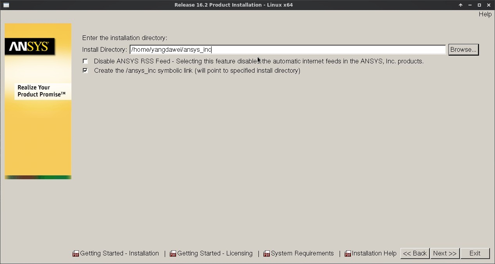
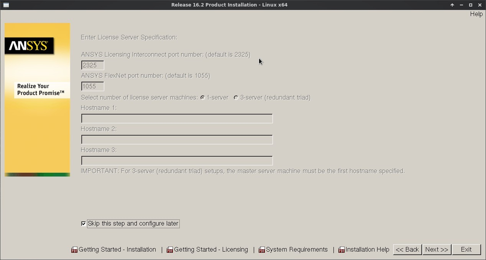
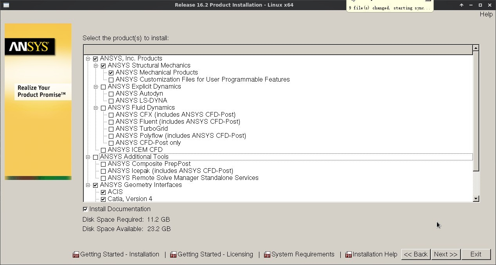
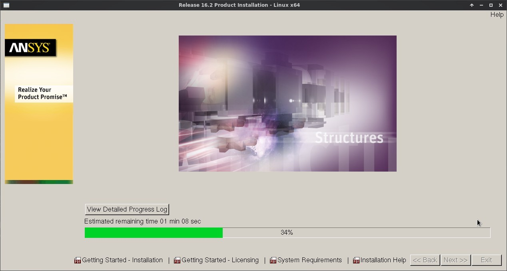
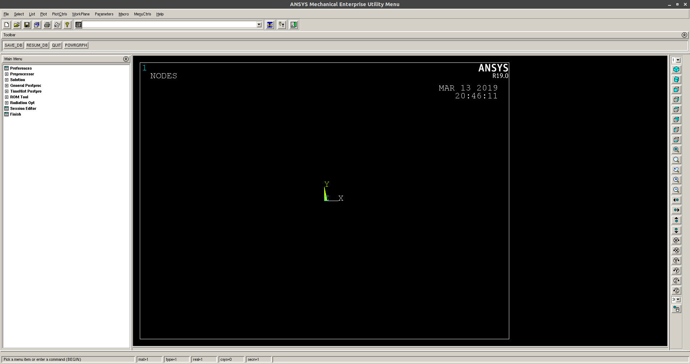

# 安装

ANSYS在Linux系统中的安装说明见安装手册，然而官方称所支持的Linux系统不支持Debian和Ubuntu。幸运的是，经过不懈搜索和尝试，我们可以在Debian和Ubuntu中安装并运行ANSYS了。下面是安装说明。

系统：Ubuntu 18.04

版本：ANSYS 19.0

## 环境准备

```
sudo apt-get install build-essential
sudo apt-get install xterm libstdc++-4.8-dev libmotif-dev libxtst-dev  libxt-dev libzip-dev  libxmu-dev
sudo apt-get install tcl8.5-dev tk8.5-dev
sudo apt-get install lsb csh xfonts-75dpi xfonts-100dpi wine-stable
```

安装trusty版本的[`libxp6`](https://packages.ubuntu.com/trusty/libxp6)和xenial版本的[`libpng12`](https://packages.ubuntu.com/xenial/libpng12-0)

## 镜像镜像与加载


加载镜像：

```
sudo mount ANSYS190_LINX64_DVD.iso /mnt
```

## 安装

N镜像加载后进入目录执行INSTALL:

```
sudo ./INSTALL
```

若无法启动安装画面，需执行：

```
xhost +
```

或将该行命令加于`/.profile`中使其启动时自动执行。

```
sudo mv /usr/bin/sh /usr/bin/sh.bak
sudo ln -s /usr/bin/bash /usr/bin/sh
```

ubuntu中的`sh`默认链接是`dash`，将其改为`bash`

- 安装过程中会在进度条`91 %`的地方卡住，强行关闭安装对话框即可。当然这会导致`\mnt`不能卸载镜像，精细的办法有，但简单粗暴的办法就是重启系统。


- 选择`Install ANSYS Products`

  

- 选择`I AGREE`

  

- 选择安装目录。我预留的`/usr`空间有限，选择了`/home/yangdawei`分区。

  

- 跳过服务器主机名定义。

  

- 去掉其它模块，仅留下`ANSYS Structural Products`。

  

- 跳过`NX information`设置。

  

- 确认设置，开始安装。

  

- 耐心等待，中间会弹出对话框要求换镜像文件。

  

- 退出。

  

## 破解

将`_SolidSQUAD_/ANSYS.19.0.LOCAL.LICENSING.LINUX64.CRACK-SSQ.tar.gz`解压后，将文件夹`shared_files`拷贝到`<ANSYS>/ansys_inc/` 中，其中`<ANSYS>`为安装目录。

```
tar -zxvf ANSYS.19.0.LOCAL.LICENSING.LINUX64.CRACK-SSQ.tar.gz
```

## 配置

- 建立软链接。为方便运行`ansys190`，在`/usr/bin`中建立可执行程序的软链接。

```
sudo ln -s /usr/ansys_inc/v190/ansys/bin/ansys190 /usr/bin/ansys190
sudo ln -s /usr/ansys_inc/v190/ansys/bin/launcher190 /usr/bin/launcher190
```

- 此时运行`ansys190 -g`会启动ansys，然而退出时会报错：

  

  为此需要在执行路径(/usr/bin)中建立一个脚本`ansys`：

  sudo vi /usr/bin/ansys

  ```
  #! /bin/bash
  #
  unset XMODIFIERS
  unset GTK_IM_MODULE
  unset QT_IM_MODULE
  unset QT4_IM_MODULE
  unset CLUTTER_IM_MODULE

  ansys190 -g

  export XMODIFIERS="@im=fcitx"
  export GTK_IM_MODULE=fcitx
  export QT_IM_MODULE=fcitx
  export QT4_IM_MODULE=fcitx
  export CLUTTER_IM_MODULE=xim
  ```

  给该脚本增加可执行权限：

  sudo chmod +x /usr/bin/ansys

- 同理还要建立一个`launcher`的脚本，内容如下：


  ```
  #! /bin/bash
  #
  unset XMODIFIERS
  unset GTK_IM_MODULE
  unset QT_IM_MODULE
  unset QT4_IM_MODULE
  unset CLUTTER_IM_MODULE

  launcher190

  export XMODIFIERS="@im=fcitx"
  export GTK_IM_MODULE=fcitx
  export QT_IM_MODULE=fcitx
  export QT4_IM_MODULE=fcitx
  export CLUTTER_IM_MODULE=xim
  ```
## 运行程序

- 运行时会报错无法找到所需要的`libz.so.1`，将`/usr/ansys_inc/.../libz.so.1`中的文件移除，做一个软连接：
```
sudo ln -s /usr/lib/x86_64-linux-gnu/libz.so /usr/ansys_inc/v190/aisol/lib/linx64/libz.so.1
sudo ln -s /usr/lib/x86_64-linux-gnu/libstdc++.so.6 /usr/ansys_inc/v190/ansys/syslib/AnsMechSolverMesh/libstdc++.so.6
```

- 在终端中运行`ansys`即可运行ansys的窗口程序。
- 运行`launcher`亦可实现launcher方式的启动。

  
