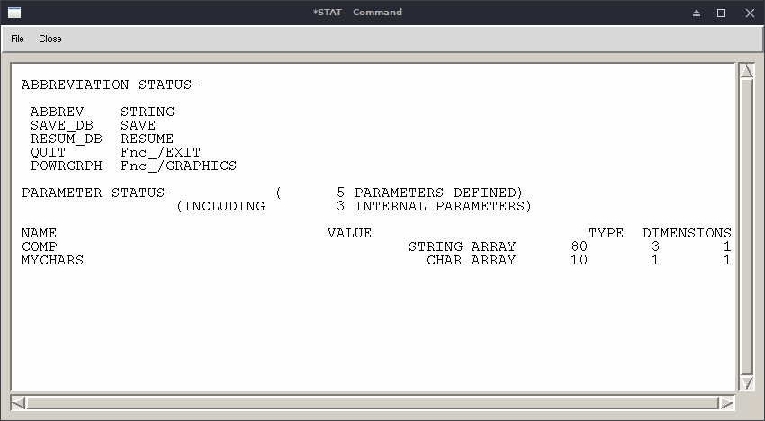

# 字符串

字符串(character strings)在APDL中可按两种方式存储：`字符参数(character
parameter)`和`字符数组(string array)`。

## 字符参数

字符参数在使用中不必使用指标，也不必使用`*dim`命令，它被作为一个标量变
量使用。但它量多只能有8个字符。比如：

```
myChr = 'yeehah'
/title,Working on Model %myChr%
```

## 字符数组

为了避免大小限制，就要使用字符数组，需要用到`*dim`命令：

```
*DIM, myString, STRING, 80
```

这将会定义一个字符串，长度为80，变量名为`myString`。引用该变量时，需要
用到`变量名`和`起始指标，即1`。比如：

```
/title, Working on Model %myString(1)%
/com, %myString(1)%
```


## 要点

在使用字符串需谨记如下要点：

- 定义字符串值时，需用单引号括住文字，如`'text'`；
- 最长的字符数组长度为256，但可以将字符数组结串使用； 
- 字符数组可以是2维的，若有一串字符数组使用，可用`*dim`处理；
- 亦可用字符参数数组(CHAR)，此时即为若干字符参数构成的列表；
- 查看哪些量是字符参数数组，哪些是2维字符数组，使用命令`*stat`。


在定义数组时，

- CHAR, 最多8个字符；
- STRING, 最多为IMAX个字符，IMAX为8的整数倍，最大值为248。

## 测试

```
% 定义一个长度为10的字符参数数组
*dim, mychars, char, 10
mychars(1) = 'dog'
mychars(2) = 'cat'
/com,%mychars(1)%
/com,%mychars(2)%

% 定义一个80x3(80行3列)的2维字符数组
% 每个字符数组沿列存储
*dim,comp,string,80,3
comp(1,1) = 'leftSide'
comp(1,2) = 'rightside'
comp(1,3) = 'topside'

*stat
```

显示结果，如图：



## 参考

- [Manipulating Text Strings in ANSYS Mechanical
  APDL](http://www.padtinc.com/blog/manipulating-text-strings-in-ansys-mechanical-apdl/)
- *DIM, Mechanical APDL Command Reference 
