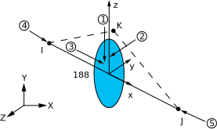

# BEAM188

3-D 2节点梁

## 单元描述

BEAM188几何信息：

## 单元技术和用法建议

## 输入数据

## 截面

## 荷载

## 输入摘要

## 输出数据

| 输出量名称 | Item  | I |  J |
|------------|-------|---|----|
| Fx         | SMISC | 1 | 14 |
| My         | SMISC | 2 | 15 |
| Mz         | SMISC | 3 | 16 |

## 假定和限制

## 示例代码
