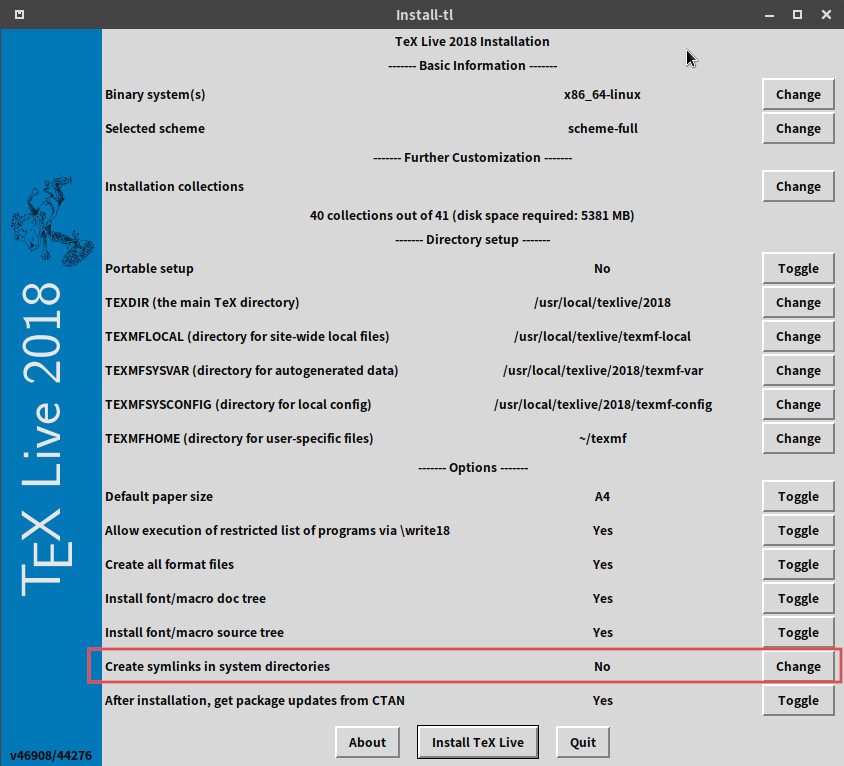

# TeX Live

TeX Live 是一款编译TeX文档的产品系统，提供了适用于Unix、GNU/Linux，和Windows中运行的TeX系统。维护者为[TUG, TeX Users Group](tug.org)。该系统下载方式有很多种，见`http://tug.org/texlive/`。

## 下载
最快倢的方式是通过国内镜像网站下载：见`http://tug.org/texlive/acquire-netinstall.html`中的[list of CTAN mirrors](https://ctan.org/mirrors)，选择中国任意镜像网站即可，如[mirrors.ustc.edu.cn](http://mirrors.ustc.edu.cn/CTAN/)中的[TeXLive](http://mirrors.ustc.edu.cn/CTAN/systems/texlive/):

   - http://mirrors.ustc.edu.cn/CTAN/systems/texlive/Images/

TeXLive每年发布一个新版本，下载目录中的任意镜像文件即可。

## 安装

- Windows:  运行`install-tl-advanced.bat`
- Linux: `sudo ./install-tl`；若安装了`perl-tk`，还可以图形界面安装：`sudo ./install-tl --gui`
- 注意：`生成系统目录链接`置于`Yes`

