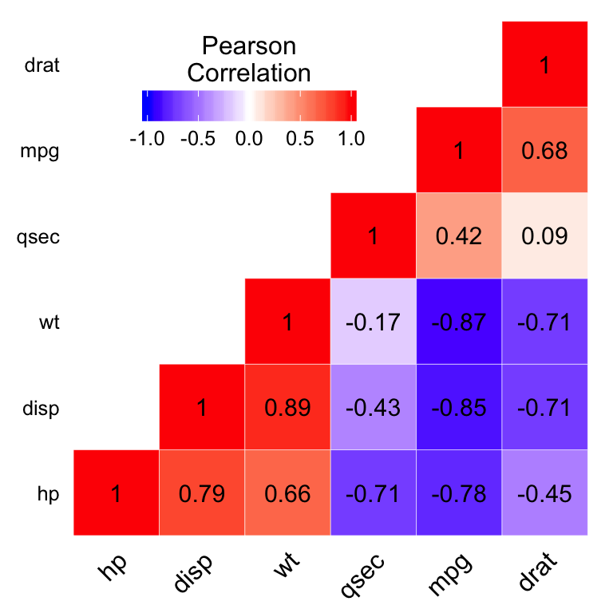

本文档汇总r数据图示例。
# 准备
## 安装
    install.packages("ggplot2")
## 加载
    library(ggplot2)

# 示例
## 索力柱状图

- 描述：给定索力数据文件data.txt，绘制索力柱状图。


- 源码：

```
#  Function：
#
#  by Xu wenjing
#  Harbin Institute of Technology
#  Mar. 10 2016
```
## 矩阵热图

- 描述：将矩阵用热图表达，直观而简洁。
- 参考：<http://www.sthda.com/english/wiki/ggplot2-quick-correlation-matrix-heatmap-r-software-and-data-visualization>




