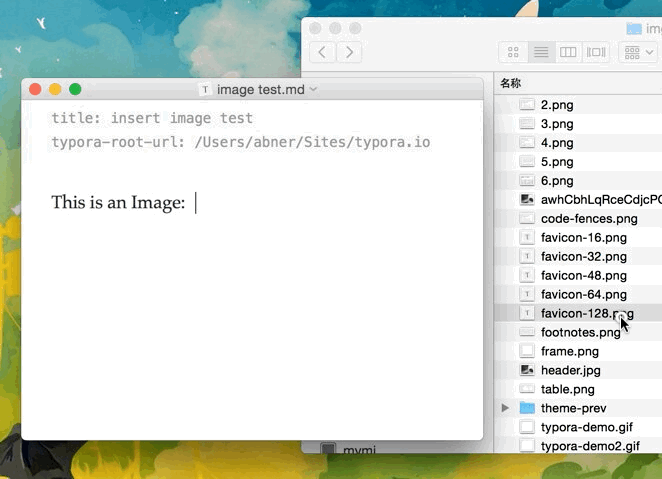

#  Markdown + Typora

<div align="center">
 &emsp; &emsp;&emsp; 
</div>


- 参考：
  - https://support.typora.io/Markdown-Reference/
  - https://zh.wikipedia.org/zh-hans/Markdown
- 本文档在持续更新，最新版本请察看[这里](https://github.com/yangdaweihit/haohaolearn/blob/master/typora/README.md)
- 本文要回答如下问题：
  - Why Markdown：语法简单、撰写高效、文档漂亮；
  - 啥Markdown：请阅读本文；
  - 咋Markdown：[下载](https://typora.io/#download)安装Typora，按本文说明的语法写就完了。

- 本文不能回答如下问题：
  - Markdown啥：原则上啥都行，具体爱啥啥。
- 若您正在阅读本文的PDF格式版本，则文内的`返回`链接和`动画插图`可能无效。

**Markdown**是一种[轻量级标记语言](https://zh.wikipedia.org/wiki/轻量级标记语言)，创始人为[约翰·格鲁伯](https://zh.wikipedia.org/wiki/約翰·格魯伯)（英语：John Gruber）。它允许人们使用易读易写的纯文本格式编写文档，然后转换成有效的[XHTML](https://zh.wikipedia.org/wiki/XHTML)（或者[HTML](https://zh.wikipedia.org/wiki/HTML)）文档。这种语言吸收了很多在[电子邮件](https://zh.wikipedia.org/wiki/电子邮件)中已有的纯文本标记的特性。

由于Markdown的轻量化、易读易写特性，并且对于图片，图表、数学式都有支持，目前许多网站都广泛使用Markdown来撰写说明文件或是用于[论坛](https://zh.wikipedia.org/wiki/网络论坛)上发表讯息。如GitHub、Reddit、Diaspora、Stack Exchange、OpenStreetMap 、SourceForge、[简书](https://zh.wikipedia.org/wiki/简书)等，甚至还能被使用来撰写[电子书](https://zh.wikipedia.org/wiki/電子書)。

更多关于Markdown的介绍见[这里](https://zh.wikipedia.org/zh-hans/Markdown)。

[Typora](https://typora.io/)是目前我们见到的撰写Markdown文档的最佳工具，还是Markdown的最佳阅读器。本文介绍了[Typora](https://typora.io/)所支持的Markdown语法格式和渲染方式。


[toc]


## 块单元

### 段落和行断

- 一个段落即连续的文字行。
- 段落由一个或多个空白行分隔。
- 回车(`Return`)生成一个新的段落。

[返回](#Markdown笔记)

### 标题(Header)

标题使用1-6个`#`开头，对应1-6级标题。如：

```

# This is an H1 

## This is an H2 

###### This is an H6

```

- 快捷键：`Ctrl + 1`表示1级标题，以此类推。

[返回](#Markdown笔记)

### 块引用

Markdown用邮件样式`>`符号表示块引用。

源码：

```
> This is a blockquote with two paragraphs. This is first paragraph.
>
> This is second pragraph. Vestibulum enim wisi, viverra nec, fringilla in, laoreet vitae, risus.
```

渲染：

> This is a blockquote with two paragraphs. This is first paragraph.
>
> This is second pragraph. Vestibulum enim wisi, viverra nec, fringilla in, laoreet vitae, risus.

- 快捷键：`Ctrl + Shif + Q`表示1级标题，以此类推。

[返回](#Markdown笔记)

### 列表

- 键入`*`建立一个无顺序列表。（`*`可被`+`或`-`替代）

- 键入`1.`生成一个有顺序列表。

  ```
  ## 无序列表
  *   Red
  *   Green
  *   Blue
  
  ## 有序列表
  1.  Red
  2. 	Green
  3.	Blue
  ```

[返回](#Markdown笔记)

### 任务列表

任务列表用`[ ]`或`[x]`标识，如：

```
- [ ] a task list item
- [ ] list syntax required
- [ ] normal **formatting**, @mentions, #1234 refs
- [ ] incomplete
- [x] completed
```

- [ ] a task list item 

- [x] list syntax required 
- [x] normal ***\*formatting\****, @mentions, #1234 refs 
- [ ] incomplete 
- [x] completed

[返回](#Markdown笔记)

### 代码块

Typora只支持Github风格的代码块Markdown语法，而不是Markdown原始的代码块样式。

使用代码块很容易，键入\```，然后回车。在\```后面跟上一个语言名称，可以对代码进行相应的语法高亮渲染。

源码：

```
​```
function test() {
  console.log("notice the blank line before this function?");
}
​```

语法高亮:
​```ruby
require 'redcarpet'
markdown = Redcarpet.new("Hello World!")
puts markdown.to_html
​```
```
渲染：
```
function test() {
  console.log("notice the blank line before this function?");
}
```

```ruby
require 'redcarpet'
markdown = Redcarpet.new("Hello World!")
puts markdown.to_html
```

[返回](#Markdown笔记)

### 数学式块

Typora可使用**MathJax**渲染$\LaTeX{}$。

- 换成其它编辑器，尚没有找到这样立等可取的效果。
- 若在Github上察看本文档，你将无法看到公式被渲染的效果。因为我们没法在markdown文档中加入Mathjax引擎。
- 在Typora中这些工作都被自动完成。
- 鼠标单击渲染后的公式，数学式块自动切换为源码，并弹出菜单动态显示出对应的渲染公式。

要添加一个数学式，可输入`$$`后按`Return`键。如：

$$\mathbf{V}_1 \times \mathbf{V}_2 =  \begin{vmatrix} \mathbf{i} & \mathbf{j} & \mathbf{k} \\ \frac{\partial X}{\partial u} &  \frac{\partial Y}{\partial u} & 0 \\ \frac{\partial X}{\partial v} &  \frac{\partial Y}{\partial v} & 0 \\ \end{vmatrix} $$ 

其代码为：

```
$$
\mathbf{V}_1 \times \mathbf{V}_2 =  \begin{vmatrix}
\mathbf{i} & \mathbf{j} & \mathbf{k} \\
\frac{\partial X}{\partial u} &  \frac{\partial Y}{\partial u} & 0 \\
\frac{\partial X}{\partial v} &  \frac{\partial Y}{\partial v} & 0 \\
\end{vmatrix}
$$
```

 更多细节在[这里](https://support.typora.io/Math/)。再来一个漂亮的公式吧：
$$
\begin{align*}
y = y(x,t) &= A e^{i\theta} \\
&= A (\cos \theta + i \sin \theta) \\
&= A (\cos(kx - \omega t) + i \sin(kx - \omega t)) \\
&= A\cos(kx - \omega t) + i A\sin(kx - \omega t)  \\
&= A\cos \Big(\frac{2\pi}{\lambda}x - \frac{2\pi v}{\lambda} t \Big) + i A\sin \Big(\frac{2\pi}{\lambda}x - \frac{2\pi v}{\lambda} t \Big)  \\
&= A\cos \frac{2\pi}{\lambda} (x - v t) + i A\sin \frac{2\pi}{\lambda} (x - v t)
\end{align*}
$$

[返回](#Markdown笔记)

### 表格


[返回](#Markdown笔记)


### 脚标

You can create footnotes like this[^fn1] and this[^fn2]. 


[^fn1]: Here is the **text** of the first ***\*footnote\****. 
[^fn2]: Here is the **text** of the second ***\*footnote\****. ↩

### 水平线

在一个空行处输入 `***` 或`---`然后 `return`即可画出一条水平线。

### 目录

输入`[toc]`后按`Return`即生成一个目录节。目录提取本文档中的所有标题，其内容将随文件内部动态更新。

##   跨越单元

[返回](#Markdown笔记)


### 链接

Markdown支持两类链接：`inline`和`reference`。两种链接中，链接文字都被方括号包围。


#### 行内链接
```
This is [an example](http://example.com/ "Title") inline link.
[This link](http://example.net/) has no title attribute.
```

[返回](#Markdown笔记)

#### 内部链接

用标题样式作为引用即可实现内部链接。按`Ctrl`键同时点击该链接即可跳转到引用处。如：

```
[返回](#Markdown使用说明)
```

[返回](#Markdown笔记)

#### 参考链接

引用风格链接

[返回](#Markdown笔记)

### URLs

Typora支持用`<>`包含的地址作为链接，如`<i@typora.io>`变为： <i@typora.io>。

同时Typora亦可自动将标准地址格式变为链接。

[返回](#Markdown笔记)

### 图片

插图与链接语法相同，只是在链接前额外加一个`!`。语法示例：

```
 

```

- 可直接拖拽图片到Typora里面。如下面的动画[^ani]所示：

  

- 若图片与文档在同一文件夹或子文件夹中，则默认采用相对路径。

[^ani]: 如果察看的是本文档的`PDF`格式版本，你将看不到下面的插图动画效果。

[返回](#Markdown笔记)

### 强调

[返回](#Markdown笔记)

### 加粗

[返回](#Markdown笔记)

### 代码

[返回](#Markdown笔记)

### 删除线

[返回](#Markdown笔记)

### Emoji
Emoji :happy:

[返回](#Markdown笔记)

### 行内数学式

[返回](#Markdown笔记)

### 下角标

[返回](#Markdown笔记)

### 上角标

[返回](#Markdown笔记)

### 高亮

[返回](#Markdown笔记)


## HTML				

<span style="color:red">this text is red</span>

### 下划线

[返回](#Markdown笔记)

### 嵌入内容

[返回](#Markdown笔记)

### 视频

[返回](#Markdown笔记)

### 其它HTML支持

[返回](#Markdown笔记)